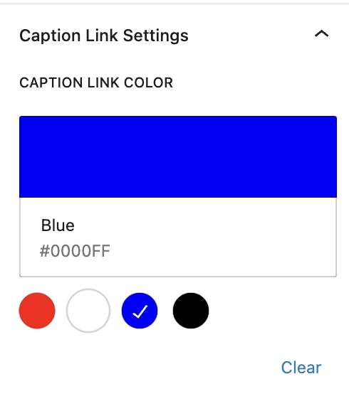
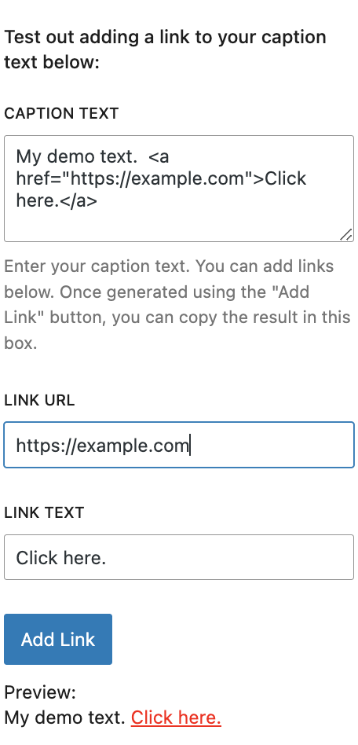
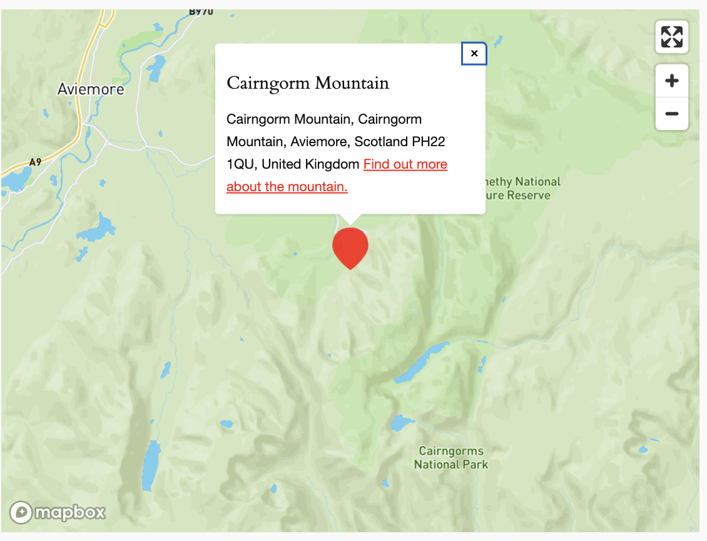

# KA Jetpack Maps Custom Caption Links

## Screenshots

  
Color Picker

  

  
Caption Text Demo Section

  

  
Marker Caption With Link

  

## About

Extend the Jetpack Map block with custom caption links.

This plugin extends the Jetpack Map block by allowing you to add clickable links to marker captions. You can also set the caption link color based on four preset colors. A demo section allows you to type in your caption text, add your link, and add your link text. Clicking preview changes the demo caption text to include the link markup, which you can then copy over to the marker you'd like to add the link to.

## Usage

- You need to add a Jetpack Map block to a post or page on your site, so will need the Jetpack plugin: https://wordpress.org/plugins/jetpack/
- Download the ZIP of this repository: https://github.com/coder-karen/ka-jetpack-maps-custom-caption-links/archive/refs/heads/master.zip
- Upload the zipped plugin to your site.
- Activate the plugin
- Open up the settings sidebar for the Jetpack Map block you had added previously - the new settings should be visible.

## License

KA Jetpack Maps Custom Caption Links is licensed under the GPL v2 or later. A copy of the license is included in the root of the plugin’s directory.